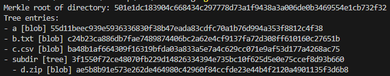
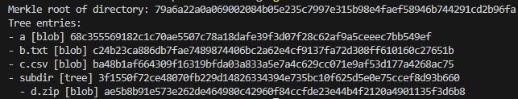

# margit (Minimal Git-like VCS in Go)

This is a simple version control system written in Go that mimics Git's core concepts using a Merkle DAG. It currently supports:

- Hashing files into `blob` objects
- Representing directories as `tree` objects
- Storing all objects on disk using content-addressed storage (`.margit/objects/`)
- Recursively walking a directory to compute its Merkle root
- Printing a tree view of the directory structure using stored objects
- Print the commit history
- Show uncommitted changes

## 📁 Example Structure

Given a folder like this:

```
project/
├── a
├── b.txt
├── c.csv
└── subdir/
    └── d.zip
```

Running the program will:

- Create `blob` objects for each file
- Create `tree` objects for `project/` and `subdir/`
- Store them in `.margit/objects/<sha256>`

## 🛠 Usage

1. Run the program with a target directory (e.g. `test/`)
2. It will create a `.margit/objects/` folder (if not already present)
3. The Merkle root hash is printed, along with the tree structure

## 🔄 Behavior

- Changing any file causes a new blob and updated tree objects to be created
- Unchanged files/directories are reused via their content hashes

Small demo:



After making a small change to `test/test1/a`:



## 🔧 Next Steps (WIP)

- Support for:
  - Branches
  - Staging and unstaging files
  - Tagging commits
- Object compression and type prefixing (like Git's loose objects)

## 🤔 Why "margit"?

[Margit, The Fell Omen](https://eldenring.wiki.fextralife.com/Margit,+The+Fell+Omen) is a boss in the video game _Elden Ring_. There's no connection to the project apart from the name being a play on "Git" and the character's name and the fact that I'm a fan.

## 🤔 Why Golang?

Because I want to learn Go and this is a fun project to explore its features.
